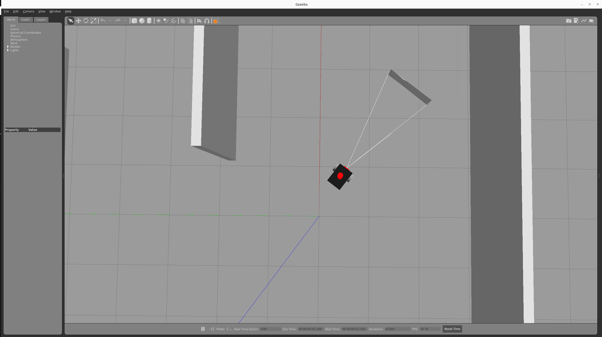
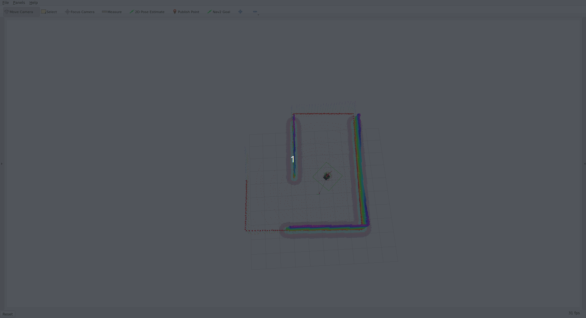

# 모바일 자율주행 시뮬레이터
본 시뮬레이터는 IITP 과제중 on-device에서 수행하기 위한 자율주행을 검증하기 위하여 만든 프로토타입입니다.


## 환경

- 개발 환경 : Ubuntu 22.04
- 시뮬레이터 : Gazebo
- 모바일 로봇 : KRM-Auto
- ROS 2 humble


## 사전 설치 파일들

```bash
sudo apt-get install -y \
    ros-humble-fast-gicp \
    ros-humble-robot-localization \
    ros-humble-imu-filter-madgwick \
    ros-humble-controller-manager \
    ros-humble-diff-drive-controller \
    ros-humble-interactive-marker-twist-server \
    ros-humble-joint-state-broadcaster \
    ros-humble-joint-trajectory-controller \
    ros-humble-joint-state-publisher-gui \
    ros-humble-joy \
    ros-humble-robot-state-publisher \
    ros-humble-teleop-twist-joy \
    ros-humble-twist-mux \
    ros-humble-cartographer* \
    ros-humble-test-msgs \
    ros-humble-spatio-temporal-voxel-layer* \
    ros-humble-rmw-cyclonedds-cpp* \
    ros-humble-mavros-msgs \
    ros-humble-pcl-ros \
    ros-humble-ndt-omp \
    ros-humble-vision-msgs* \
    ros-humble-nav2-msgs* \
    ros-humble-sensor-msgs \
    ros-humble-libstatistics-collector* \
    ros-humble-ouster-msg*

sudo apt install -y \
    wget \
    tmux \
    tmuxp \
    libgraphicsmagick++-dev \
    libxtensor-dev \
    libompl-dev \
    libomp-dev \ 
    python3-pip \
    python3-colcon-*

sudo apt install -y \
    ros-humble-gazebo-ros-pkgs \
```

## 환경 설정

```bash
source /opt/ros/humble/setup.bash
source ~/packages/setup.bash
```

## 실행 방법

```bash
# Terminal 1
tmuxp load krm_auto_simulator.yaml
```

```bash
# Terminal 2
tmuxp load krm_auto_gazebo_nav2.yaml
```


## 결과





