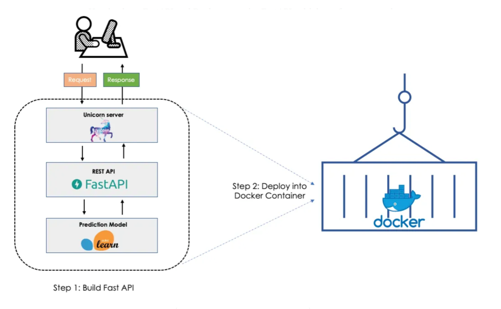

# Detection_Inference

----

>이 프로젝트는 RTSP 스트림에서 YOLO 모델로 객체를 탐지하고, 결과를 MQTT를 통해 퍼블리싱하는 서버를 구축합니다. 주요 구성과 동작은 다음과 같습니다.



## Demo code
Docker 컨테이너안에서 MQTT를 제외한 Multi Threading을 통해 모델을 추론합니다.

```python
docker build -t inference_image:latest .
docker run --gpus all -it --network host inference_image:latest 
python3 inference_multistream.py
```


## 1. Directory Structure

```bash
app
├── api   # 실행할 api 정의
│   └── inference.py
├── config # config 값 세팅
│   ├── config.py
│   ├── config.yaml
│   └── __init__.py
├── Dockerfile # 의존환경을 도커파일로 관리
├── inference
│   ├── __init__.py
│   └── yolo_inference.py # 추론 동작 코드
├── __init__.py
├── main.py  # fast api 실행
├── models.py
├── mqtt  
│   ├── __init__.py
│   └── _mqtt_publisher.py # mqtt 프로토콜을 통신 정보 전송
├── pt_files
│   └── best.pt # 학습된 모델
├── requirements.txt # 필요 라이브러리 
├── script.sh
└── utils
    └── url_parser.py
```


api/inference.py: 탐지 시작/중지 API 제공 (FastAPI 기반).

config/config.yaml: 설정 파일 (서버, MQTT, YOLO 관련 설정).

inference/yolo_inference.py: YOLO 모델 기반 탐지 및 추론 처리.

mqtt/mqtt_publisher.py: MQTT로 탐지 결과 퍼블리싱.

main.py: FastAPI 서버의 진입점.

pt_files/: YOLO 모델 가중치 저장.

## 2. FastAPI API

/api/inference/start: RTSP 스트림의 탐지 시작.

/api/inference/stop: 특정 스트림 탐지 중지.


## 3. Config file

config.yaml: 서버, MQTT, 모델 경로, 신뢰도 임계값 등을 중앙에서 관리.

config.py: YAML 설정을 로드해 전역적으로 활용.


## 4. Inference 

YOLO 초기화: GPU 지원, 모델 로드.

RTSP 스트림 캡처: GStreamer로 프레임 캡처.

객체 탐지: YOLO 모델로 신뢰도 높은 객체 필터링.

결과 전송: MQTT로 JSON 형식 퍼블리싱.

스트림 관리: 탐지 시작/중지 및 쓰레드 관리.

## 5. MQTT 퍼블리싱
탐지 결과를 브로커로 전송.
JSON 형식, 재연결 로직 포함.

## 6. 전체 흐름
API 요청으로 탐지 시작.

RTSP 캡처 → YOLO 탐지 → 결과 MQTT 퍼블리싱.

API 요청으로 탐지 중지.

>## 기술 스택
```
YOLOv8: 객체 탐지.
FastAPI: REST API.
MQTT: 결과 전송.
GStreamer: RTSP 처리.
Python Threading: 멀티쓰레딩 처리.
```


